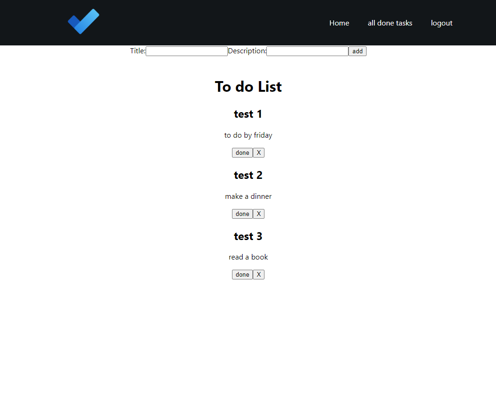
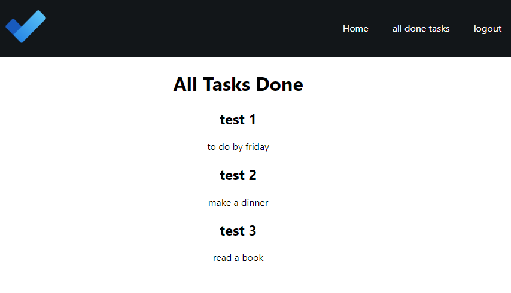

# todo list app
Simple todo list api app, built for cv purpouses. (first app using API)

## Description
You are creating an account and you can add/delete/done tasks. Once you done a task and clicked a button it will be moved to special tab "all done tasks".

## examples

## built using:

- python django
- django rest framework
- react
- axios
